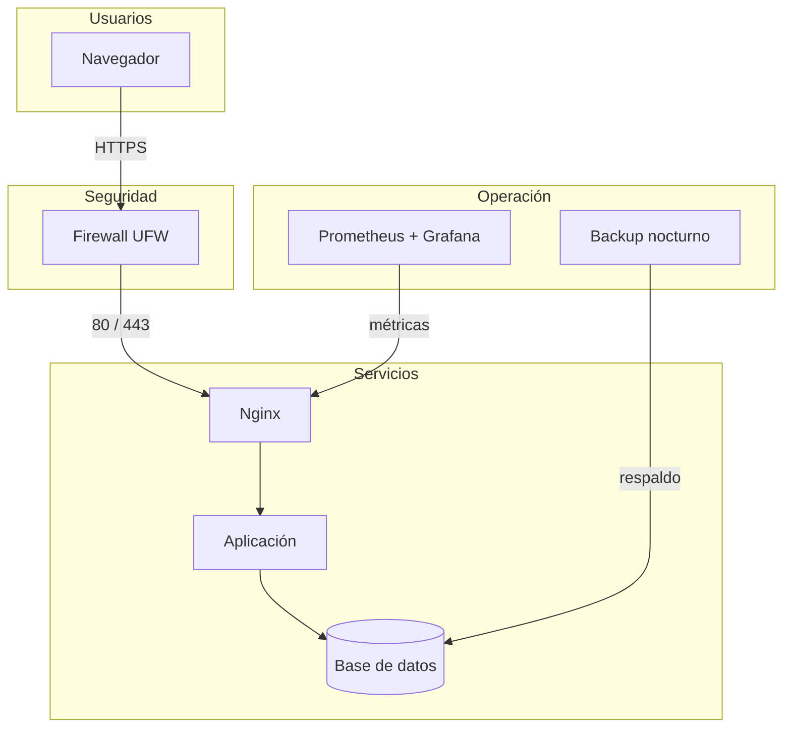

# Arquitectura por capas

```mermaid
flowchart TB
  subgraph Usuarios
    N[Navegador]
  end
  subgraph Seguridad
    F[Firewall UFW]
  end
  subgraph Servicios
    NG[Nginx] --> APP[Aplicación] --> BD[(Base de datos)]
  end
  subgraph Operacion["Operación"]
    PG[Prometheus + Grafana]
    BK[Backup nocturno]
  end
  N -- HTTPS --> F
  F -- "80 / 443" --> NG
  PG -- métricas --> NG
  BK -- respaldo --> BD
```
